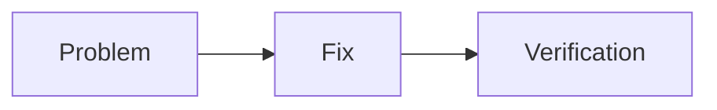

# StarkAGI Webpage

Static GitHub Pages-ready landing page for StarkAGI.

## File structure

```text
index.html
progress.html
css/style.css
js/app.js
js/progress.js
js/articles.js
data/progress.json
data/articles.json
articles/
vendor/anime.min.js
fonts/rostex/                    local display fonts used by css/style.css
vendor/mermaid.esm.min.mjs       optional, add manually for full Mermaid.js rendering
vendor/chart.umd.min.js          optional, add manually for full Chart.js rendering
vendor/CDN_SOURCE.txt
vendor/ANIME_LICENSE.txt
```

## How to use

1. The current placeholder repository URL is `https://github.com/Project-stark00/stark-agi.github.io`. Replace it later when the main Stark repository is ready.
2. Push the full folder contents to the root of your GitHub repo.
3. Enable GitHub Pages from `Settings -> Pages -> Deploy from a branch`.
4. Select your main branch and `/root`.


## Local font system

The UI uses the local Rostex files from:

```text
fonts/rostex/
```

The font loading rules are defined in:

```text
css/style.css
```

Rostex is used as the StarkAGI display identity font for the logo, hero titles, section titles, article titles, numbers, and status labels. Body text stays on readable system UI fonts for better long-form reading.

Do not remove the `fonts/rostex/` folder from your deployed GitHub Pages repo, or the browser will fall back to system fonts.

## Notes

- JavaScript and CSS are separated from HTML.
- Anime.js is bundled locally at `vendor/anime.min.js`, so the page does not depend on an external anime.js CDN request.
- The page is a static website and does not need a build step.


## Updating the Progress page

The Progress page is powered by `data/progress.json`.

To publish a new progress update:

1. Open `data/progress.json`.
2. Update `projectStatus.currentPhase`, `projectStatus.activeMilestone`, and `projectStatus.lastUpdated` if needed.
3. Add a new item near the top of the `logs` array.
4. Update the `milestones` statuses when a milestone changes.
5. Commit and push the changes to GitHub Pages.

For local preview, do not double-click `progress.html` because browsers may block JSON loading from `file://`.
Run this from the project root instead:

```bash
python -m http.server 8000
```

Then open:

```text
http://localhost:8000/progress.html
```

## Markdown Articles Page

The site includes a Markdown article reader at:

```text
articles.html
```

Use it to publish StarkAGI problem logs, solved fixes, unresolved research questions, diagrams, and charts.

### Add a new article

1. Create a new Markdown file inside:

```text
articles/
```

2. Add an entry for that file inside:

```text
data/articles.json
```

Example:

```json
{
  "slug": "my-new-problem-log",
  "title": "My New Problem Log",
  "date": "2026-05-20",
  "category": "Problem Log",
  "status": "Solved",
  "summary": "Short article summary.",
  "file": "articles/my-new-problem-log.md",
  "tags": ["Kernel", "Debugging"]
}
```

3. Open the article with:

```text
articles.html?article=my-new-problem-log
```

### Supported Markdown features

- headings
- paragraphs
- bold / italic / inline code
- links and images
- unordered and ordered lists
- blockquotes
- tables
- fenced code blocks
- simple `mermaid`, `diagram`, or `flowchart` code fences rendered as SVG diagrams
- `chart` code fences rendered as SVG bar or line charts

### Local preview note

Markdown and JSON loading uses browser `fetch()`. If you open `articles.html` directly with `file://`, your browser may block loading local files.

Preview locally with:

```bash
python -m http.server 8000
```

Then open:

```text
http://localhost:8000/articles.html
```

GitHub Pages will load the Markdown files normally after you push the repo.


## Optional full Mermaid.js and Chart.js rendering

The article reader now has a wider reading layout and can upgrade Markdown visual blocks to real Mermaid.js and Chart.js when the local vendor files are available.

The site still works without these files because `js/articles.js` keeps a built-in SVG fallback. To enable full rendering, add these files manually:

```text
vendor/mermaid.esm.min.mjs
vendor/chart.umd.min.js
```

Recommended download sources:

```text
Mermaid ESM:
https://cdn.jsdelivr.net/npm/mermaid@11/dist/mermaid.esm.min.mjs

Chart.js UMD:
https://cdn.jsdelivr.net/npm/chart.js@4/dist/chart.umd.min.js
```

After adding those files, push them with the rest of the site. The article page will automatically detect them and use:

````text

````

and:

````text
```chartjs
{
  "type": "bar",
  "data": {
    "labels": ["Before", "After"],
    "datasets": [
      {
        "label": "Noise",
        "data": [82, 31]
      }
    ]
  }
}
```
````

For local preview, run:

```bash
python -m http.server 8000
```

Then open:

```text
http://localhost:8000/articles.html
```

