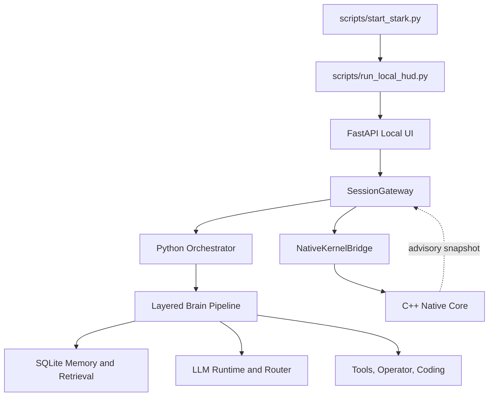
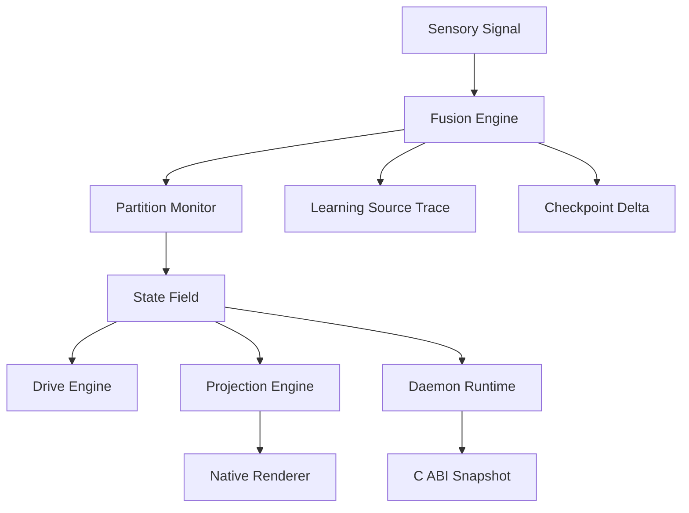
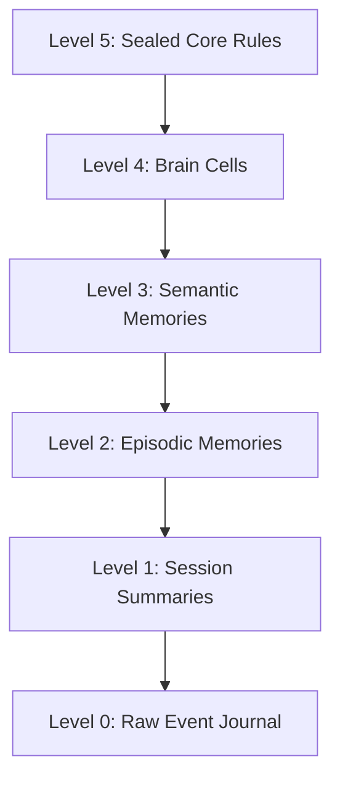
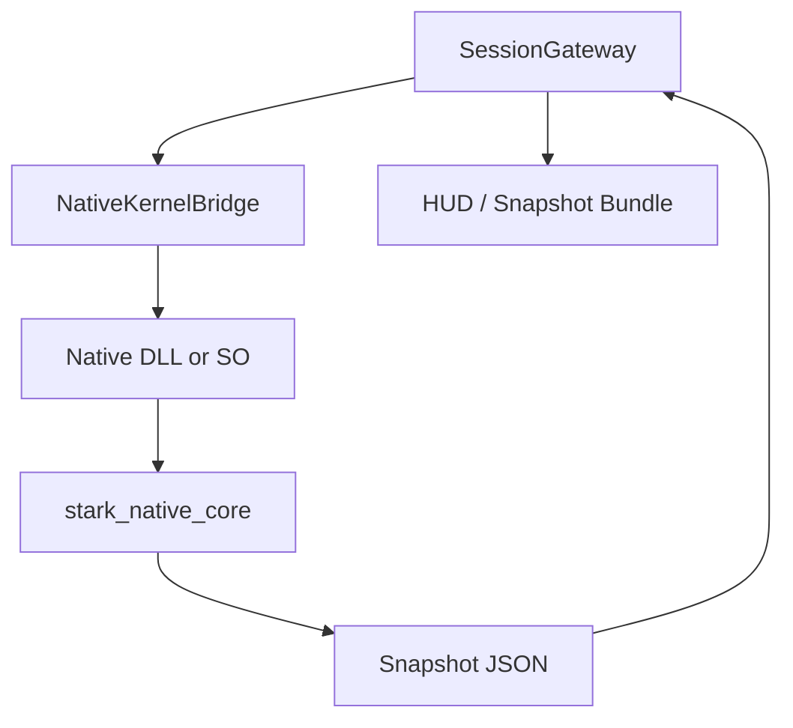
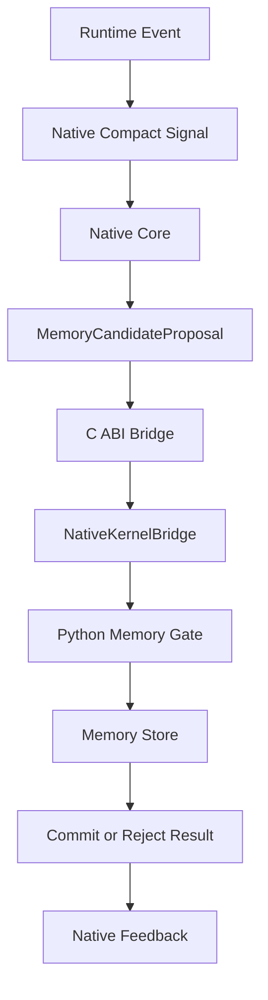
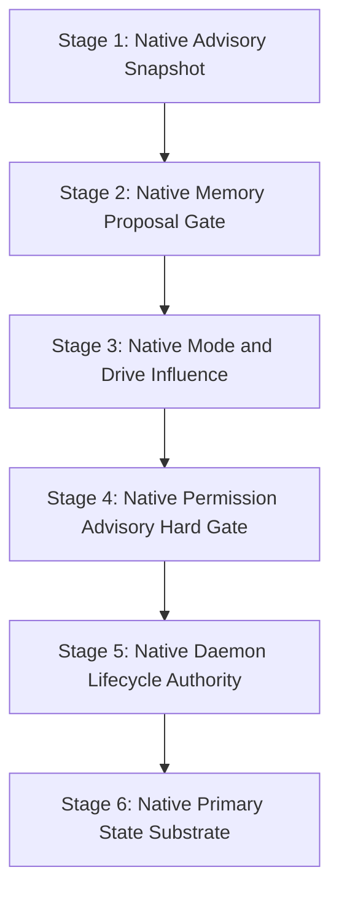

# Stark Current Architecture Snapshot

This article summarizes the current Stark architecture from the Obsidian vault.

The most important truth is simple:

> Stark currently has a real C++ native kernel substrate, but the shipped runtime is still Python-first. The native core is meaningful, bounded, and advisory-only.

That distinction matters because the project is trying to become a native digital-life architecture without pretending that the native layer already owns every decision.

## Current System Identity

Stark is currently best described as:

```text
A local-first LLM assistant runtime with strong orchestration, memory, policy, tools, and a real model-free C++ native kernel substrate bridged in as advisory evidence.
```

It is not yet:

```text
A fully native digital-life kernel where the native substrate is the primary authority and the LLM is only one swappable organ.
```

## Current Runtime Map



## Authority Today

| Layer | Current role |
|---|---|
| Python gateway / orchestrator | Owns real shipped runtime decisions |
| Python policy and tool gates | Protects tool execution and approvals |
| Python memory and prompt builder | Persists and retrieves context |
| Native bridge snapshot | Exposes native evidence to Python |
| C++ native core state | Provides bounded advisory substrate |

The target direction is different:

```text
C++ Native Kernel
  owns state, lifecycle, memory gates, and decision direction

Python / LLM Runtime
  provides language, tools, UI, persistence, and execution under native governance
```

But this target must be reached gradually.

## Native Kernel Layer

The native kernel lives in:

```text
native/stark_native_core/
```

The Python bridge lives in:

```text
assistant/native_bridge/
```

The native core is designed to be:

```text
bounded
model-free
tool-free
advisory-only
```

It currently owns low-level concepts such as:

- daemon lifecycle
- fixed-size state regions
- sensory signal fusion
- partition and write monitoring
- checkpoint deltas
- chronicle evidence
- associative memory
- idle review
- drive engine
- projection engine
- native renderer boundary checks
- work-mode planning
- C ABI bridge

## Native State Regions

The current native state field is:

```text
10 regions × 64 floats
```

The regions are:

| Region | Purpose |
|---|---|
| Survival | continuity and safety pressure |
| Perception | incoming signal interpretation |
| Host | host/user relationship state |
| Working | active short-term processing |
| Concept | conceptual state |
| Memory | native memory resonance |
| Goal | goal pressure |
| Value | value alignment signals |
| Action | action tendency |
| SelfModel | internal self-state |

This is the closest current repo component to the Stark Native Digital Life direction:

```text
continuous low-dimensional state
not tokens
not transformer hidden states
not next-token prediction
```

## Native Flow Today



## Python Runtime Layer

The Python runtime currently owns the shipped assistant behavior.

It handles:

- session gateway
- local UI and HUD
- orchestration
- brain pipeline
- memory persistence
- LLM runtime
- tool execution
- operator and coding modules
- approvals and policy
- snapshots

Important folders:

```text
assistant/gateway/
assistant/orchestrator/
assistant/brain/
assistant/memory/
assistant/llm_runtime/
assistant/tools/
assistant/operator/
assistant/coding/
assistant/security/
assistant/policy/
assistant/ui/
```

## Memory and Context Architecture

The current memory system is mostly:

```text
SQLite + FTS5 + ranking + semantic-index scaffolding + memory edges
```

Important strengths:

- local-first persistence
- SQLite WAL / FTS style practicality
- memory ranking exists
- memory edges exist
- semantic index scaffolding exists
- Obsidian import/export logic exists
- brain bridge exists

Important missing pieces for long-term Stark:

- append-only tamper-evident memory journal as source of truth
- hot / warm / cold memory separation
- daily and session compaction
- native memory proposal gate
- memory authority labels inside prompt composition
- large-scale vector backend for semantic recall
- raw event archive separated from learned memories
- active-thread context manager

## Prompt Context Problem

The current prompt builder places memory-like context inside the system message under:

```text
## CONTEXT
### MEMORIES
### EVENTS
```

That works technically, but it can blur authority between immutable system rules and retrieved memory.

The recommended future internal prompt object is:

```text
Core System
Current Mode
Active Memory State
Active Thread State
Recent Raw Conversation
Current User Message
```

Memory should become active cognitive state, not a raw blob.

## Target Memory Pyramid



## Native Bridge Flow

The current bridge exposes methods such as:

```python
health()
tick(...)
plan_work(...)
snapshot()
```

Current characteristics:

- uses `ctypes`
- loads native library from `tmp/native_core_build/`
- fails closed if the native library is missing
- marks native as `advisory_only = True`
- returns `can_execute_tools = False`

Current bridge flow:



## Next Recommended Milestone

The next safe milestone is:

```text
M1 Native Memory Gate Bridge
```

Goal:

```text
Connect native chronicle / memory proposal structures to Python memory persistence as a controlled advisory memory gate.
```

Do not do these yet:

- do not let native execute tools
- do not replace SQLite
- do not redesign the entire prompt builder
- do not jump straight to a native daemon with broad authority

Recommended flow:



## Promotion Roadmap



The architecture rule is:

```text
Do not jump from Stage 1 to Stage 6.
```

The safe step is Stage 2.

## Major Risks

| Risk | Mitigation |
|---|---|
| Promoting native too fast | promote one gate at a time |
| Memory poisoning | add authority labels, source tracking, confidence, and host override rules |
| Giant context dumps | use active memory state, summaries, pinned context, and dynamic thread windows |
| SQLite becoming both truth and search forever | use journal as truth and DB as rebuildable index |
| UI showing fake readiness | every module should show live / partial / mock status clearly |

## Builder Target

The current builder milestone should focus only on:

```text
Native MemoryCandidateProposal
  → Python MemoryGate
  → persistent journal / index
  → native feedback
```

Acceptance should include:

- native proposal visible through bridge
- Python can read proposal fields
- high-authority core/canon proposals are rejected without explicit host approval
- normal low-risk proposals can be persisted with native metadata
- native snapshot behavior remains advisory-only
- `can_execute_tools` remains false
- existing shipped tests continue passing

## Summary

Stark currently has a strong Python assistant runtime and a real C++ native core substrate.

The future direction is native authority, but the correct path is not a sudden rewrite. The correct path is staged promotion:

```text
advisory native evidence
  → native memory proposal gate
  → mode and drive influence
  → permission advisory gate
  → daemon lifecycle authority
  → primary native state substrate
```
