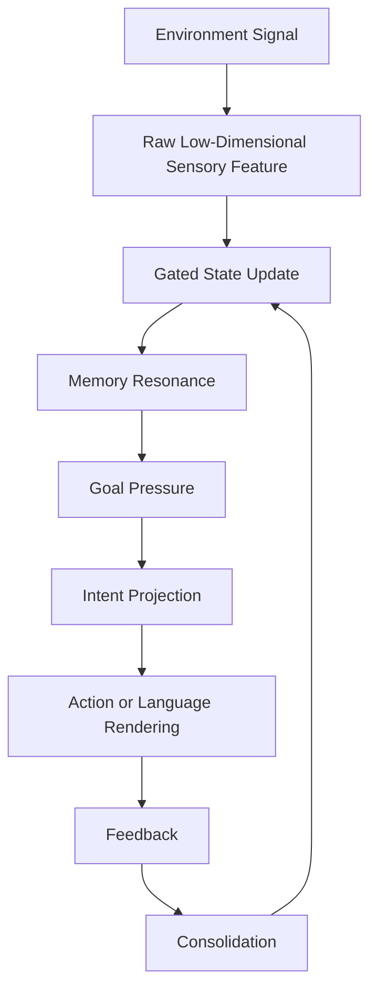

# The Core Vision: Stark Native Digital Life

Stark Native Digital Life is a fundamental departure from current AI paradigms. Rather than relying on Transformer attention, tokenization, or next-token prediction, the project implements a **local-first continuous-state cognitive runtime**.

## The Philosophy of Continuous State

At the heart of Stark is a unified continuous state field. This field is divided into functional regions dedicated to specific cognitive needs:
- **Perception**: Processing raw sensory input.
- **Memory**: Maintaining stability and resonance.
- **Goals & Values**: Driving intent and prioritizing actions.
- **Action**: Projecting intent into the environment.
- **Self-Modeling**: Adapting to the host system and internal state.

### The Native Flow
The goal is to move from a "prompt-response" cycle to a continuous flow of existence:

## The Implementation Roadmap

The build is structured into 12 distinct phases to ensure stability and safety before introducing complexity:

1. **Specification Hardening**: Defining the non-negotiable axioms and boundaries.
2. **Micro-Kernel**: Building the isolated C++ continuous-state core (the immediate target).
3. **State Region Stabilization**: Ensuring the functional regions interact without collapse.
4. **Feedback & Correction Engine**: Implementing the mechanism for state adjustment based on outcome.
5. **Chronicle Evidence Spine**: Creating a durable trail of cognitive decisions.
6. **Native Memory & MemoryStore Bridge**: Connecting the core state to external durable storage.
7. **Drive Engine**: Implementing the "will" or drive that pushes the system toward goals.
8. **Projection Engine**: Mapping internal intent to external representations.
9. **Ollama Renderer Bridge**: Utilizing LLMs as the "mouth" (rendering layer) while the core owns the "mind".
10. **24/7 Daemon Runtime**: Transitioning from a process to a persistent background life-form.
11. **Work Mode Integration**: Applying the system to productive software engineering and research.
12. **Obsidian Mirror & Braincell Export**: Creating a human-readable mirror of the internal state.

## Why This Matters

By removing the reliance on tokenization and embeddings, Stark aims to achieve a form of cognitive stability and "presence" that is impossible for standard LLMs. The first proof of success is not a fluent conversation, but a blank continuous-state core that can safely learn and recall associations without any AI framework.
