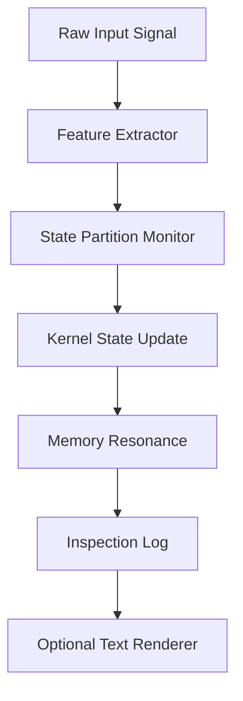

# Debugging the First StarkAGI Kernel Loop

This is an **example Markdown article**. You can use this format to write about problems you met while building StarkAGI, how you solved them, and what still needs more research.

> Goal: every problem should become reusable knowledge for StarkAGI instead of disappearing inside chat history or random notes.

## Problem

The first micro-kernel loop updated the global state vector, but the inspection log was hard to trust because the same input sometimes produced different trace order.

Symptoms:

- repeated input produced slightly different log ordering
- debug messages mixed state update and rendering concerns
- the sleep-review queue could not prove which state partition changed first
- the final result looked correct, but the path was not inspectable

## Root Cause

The kernel was doing too many things inside one loop:

1. receive raw signal
2. update state partition
3. trigger memory resonance
4. render text output
5. write inspection logs

That made the system feel alive, but it reduced proof quality.

## Fix

The loop was split into stable stages. Each stage writes its own trace record before the next stage starts.



## Verification Checklist

| Check | Expected Result | Status |
| --- | --- | --- |
| Same input repeated | Same stage order | Passed |
| Partition write boundary | No cross-zone overwrite | Passed |
| Renderer disabled | Kernel still updates | Passed |
| Sleep queue enabled | Trace remains readable | Watch |

## Before / After Signal Noise

The chart below is rendered from a JSON code fence inside the Markdown file.

```chart
{
  "type": "bar",
  "title": "Debug Noise Before and After Stage Split",
  "labels": ["Before", "After", "Target"],
  "values": [82, 31, 20]
}
```

You can also use a more complete Chart.js-style configuration. If `vendor/chart.umd.min.js` is installed, this block is rendered by Chart.js. If it is not installed, the built-in SVG fallback still renders the first dataset.

```chartjs
{
  "type": "line",
  "data": {
    "labels": ["Signal", "Partition", "Memory", "Trace"],
    "datasets": [
      {
        "label": "Inspection confidence",
        "data": [35, 58, 73, 91]
      }
    ]
  },
  "options": {
    "plugins": {
      "title": {
        "display": true,
        "text": "Inspection Confidence After Refactor"
      }
    }
  }
}
```

## What StarkAGI Should Learn

- A feature is not complete unless its behavior can be inspected.
- Rendering text must not control the native kernel decision path.
- Sleep review should consume stable traces, not mixed console output.
- If a bug cannot be reproduced, improve the trace first before guessing the fix.

## Remaining Question

The fix made the loop more inspectable, but one question remains:

> How much trace detail can StarkAGI keep before the trace itself becomes too expensive for always-on local operation?

This is not fully solved yet. The next test should compare full trace logging against compressed delta logging.

```chart
{
  "type": "line",
  "title": "Expected Trace Storage Growth",
  "labels": ["Day 1", "Day 7", "Day 14", "Day 30"],
  "values": [1, 5, 11, 24]
}
```

## Final Note

This article is only an example. Replace it with real StarkAGI development notes when the project begins producing real kernel milestones.
