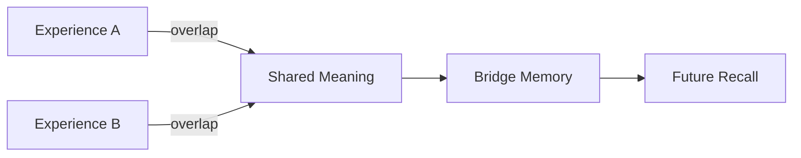

# Unsolved Memory Resonance Question

This is an example of a Markdown article for a problem that has **not** been solved yet.

## Question

When two memory regions partially overlap, should StarkAGI merge them, keep them separate, or create a bridge node between them?

## Current Thinking

Possible approaches:

- merge only when repeated feedback confirms the association
- create a temporary bridge first
- decay the bridge if it is not reused
- lock core memory changes behind host approval

## Why It Matters

A wrong merge could make StarkAGI remember two different experiences as one thing. A weak merge could make learning too slow.

## Current Status

No final decision yet. The safest next step is to create an experiment where the same signal appears in different contexts and observe whether the bridge improves recall.
