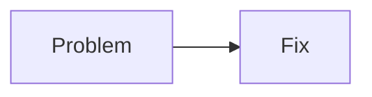

# Optional Markdown Visual Libraries

The article reader works without these files by using the built-in SVG fallback renderer.

To enable full Mermaid.js and Chart.js support, download and place these files here:

```text
vendor/mermaid.esm.min.mjs
vendor/chart.umd.min.js
```

Recommended sources:

```text
https://cdn.jsdelivr.net/npm/mermaid@11/dist/mermaid.esm.min.mjs
https://cdn.jsdelivr.net/npm/chart.js@4/dist/chart.umd.min.js
```

After both files are added, `articles.html` automatically upgrades:

````text

````

and:

````text
```chartjs
{
  "type": "bar",
  "data": {
    "labels": ["Before", "After"],
    "datasets": [{ "label": "Noise", "data": [82, 31] }]
  }
}
```
````

No build step is needed.
